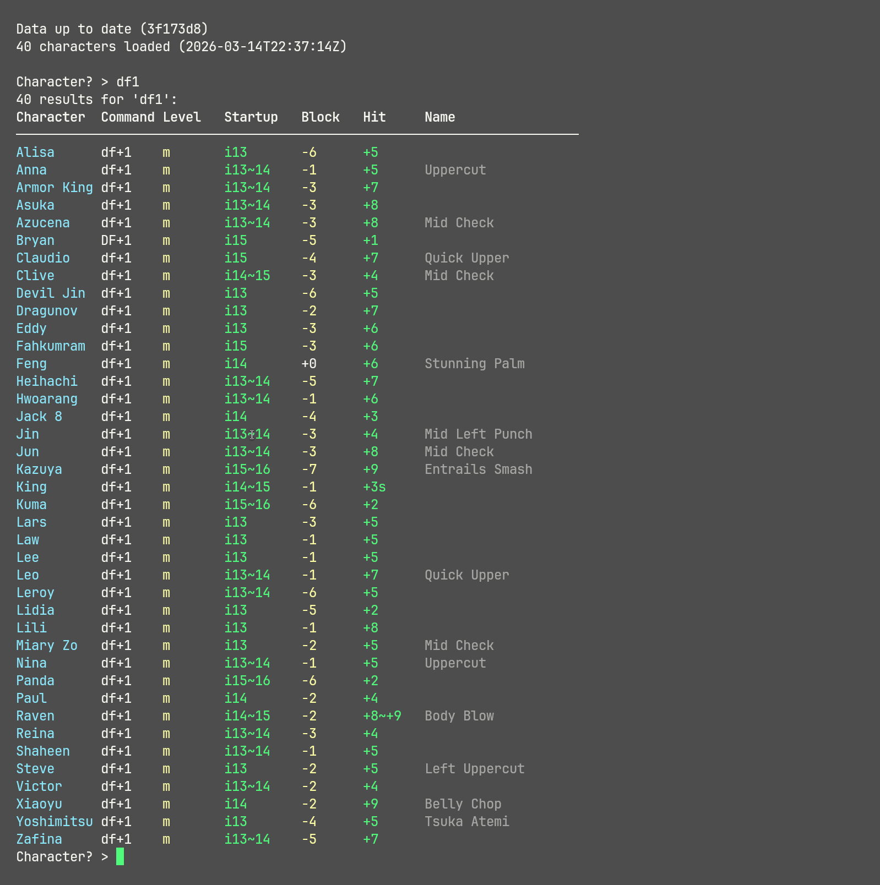
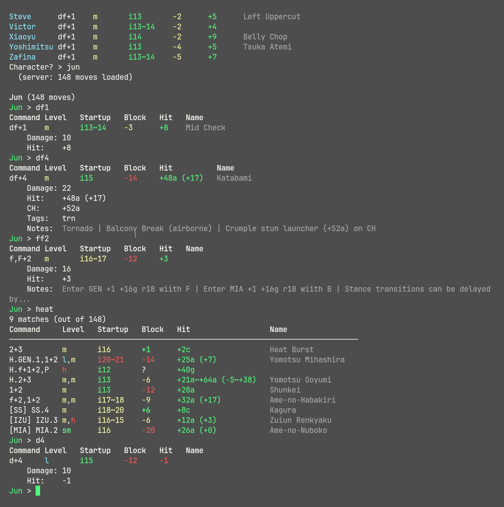
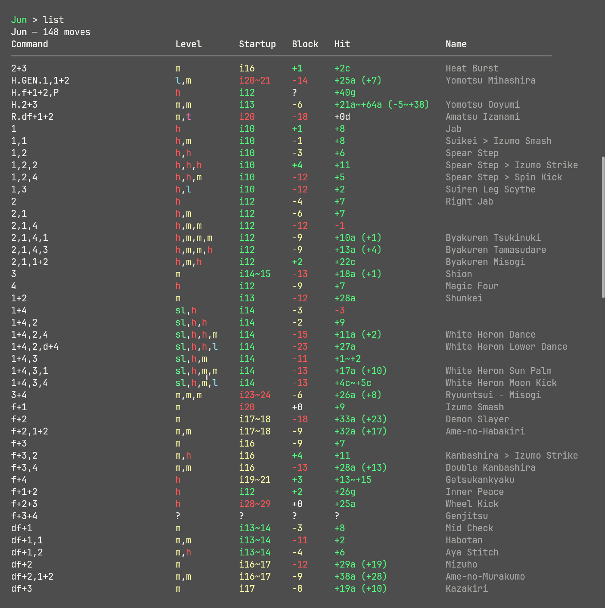
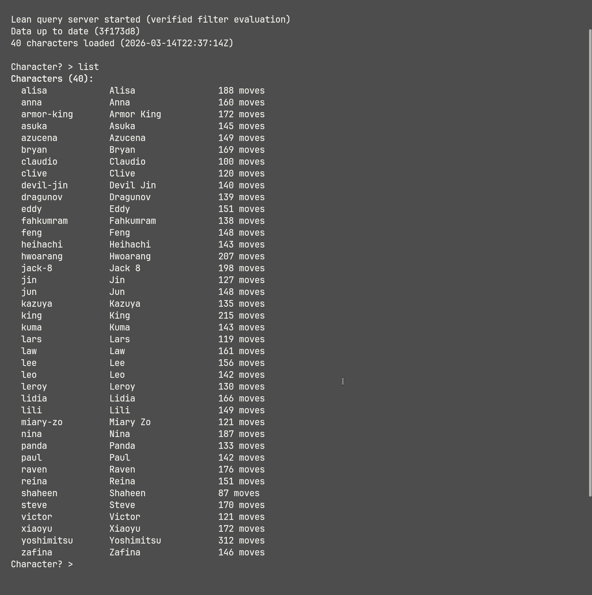

# Tekken Query

A terminal tool for looking up Tekken 8 frame data. Mainly an interactive REPL where you pick a character and query their moves with filters (safe mids, fast homing moves, heat engagers, etc.), plus a few one-shot CLI commands for scripting.

## Screenshots

<p align="center">
  
  <br><em>Global move lookup — compare df+1 across all 40 characters</em>
</p>

<p align="center">
  
  <br><em>Move lookup, notation shortcuts, filter queries, heat search</em>
</p>

<p align="center">
  
  <br><em>Color-coded frame data — green (plus), yellow (safe), red (punishable)</em>
</p>

<p align="center">
  
  <br><em>Full roster with move counts</em>
</p>

## Quick Start

### Download

Grab the latest release for your platform from [Releases](../../releases):

```
tekken-query-linux-x86_64.tar.gz
tekken-query-macos-arm64.tar.gz
tekken-query-windows-x86_64.zip
```

Each archive contains:
- `tekken-query` — **double-click this to launch**
- `tekken-cli` — the full CLI with all commands
- `tekken_query` — the backend binary

Place all files in the same directory.

> **macOS note:** If Gatekeeper blocks the binaries, run:
> `xattr -d com.apple.quarantine tekken-cli tekken_query`

### Run

```bash
# Double-click tekken-query, or from a terminal:
./tekken-query

# Same thing, launches the interactive REPL:
tekken-cli interactive
```

That's the main way to use it. One-shot CLI commands (`query`, `compare`, `move`, ...) are listed under [CLI Commands](#cli-commands) below — useful for scripting, but day-to-day use is the REPL.

## Usage

### Interactive REPL

```bash
tekken-cli interactive
```

Two-level interface: pick a character, then query their moves.

**Character selection:**
```
Character? > jin          # fuzzy match: jin, kaz, devil, yoshi...
Character? > df1          # global move lookup across all characters
Character? > ewgf         # aliases work too
Character? > list         # show all characters
Character? > list-all     # roster overview (+OB count, HS startup)
```

**Move queries** (filters are AND'd together):
```
Jin > mid plus            # plus-on-block mids
Jin > i<15 hom            # fast homing moves
Jin > low !punish         # safe lows
Jin > heat                # all heat moves (engager + smash + burst + H. state)
Jin > hit>0 mid           # mids that are plus on hit
Jin > ch>=5 low           # lows with counter-hit advantage >= +5
Jin > <+5                 # moves with block frame < +5
Jin > stance:ZEN          # moves from a specific stance
Jin > cmd:df+2            # search by command notation
Jin > pc !high            # non-high power crushes
```

**Move lookup** (with fuzzy matching and notation shortcuts):
```
Jin > df2                 # auto-expands to df+2
Jin > cd2                 # crouch dash shorthand: f,n,d,df+2
Jin > ewgf                # move alias
Jin > hopkick             # universal alias
Jin > hellsweep           # character-specific alias
```

### CLI Commands

One-shot commands for scripting or quick lookups without entering the REPL. None of these live inside the interactive mode — run them from your shell.

```bash
tekken-cli interactive          # launch the REPL (alias: i)
tekken-cli query <char> <filters...>              # one-shot filter query
tekken-cli move <char> <command>                  # look up a specific move
tekken-cli compare <char1> <char2> <filters...>   # side-by-side comparison (CLI only)
tekken-cli chars                # list all characters
tekken-cli stats <char>         # character stats summary
tekken-cli check                # check for upstream data updates
tekken-cli fetch                # download/update frame data
```

`compare` runs the same filter against two characters and prints two tables back to back with a shared column layout, e.g. `tekken-cli compare jin kazuya mid plus` to see both rosters' plus-on-block mids side by side.

### Filter Reference

| Filter | Meaning |
|--------|---------|
| `high`, `mid`, `low` | Hit level |
| `throw` | Throw moves |
| `plus` | Plus on block (> 0) |
| `minus` | Negative but safe (-1 to -9) |
| `punish` | Punishable (<= -10) |
| `guardable` | Opponent can still guard on block |
| `i15`, `i<15`, `i>=15` | Startup frame comparisons |
| `<+5`, `>-10`, `<=0`, `>=+3` | Block frame comparisons |
| `block<+5` | Explicit block frame comparison |
| `hit>0`, `hit>=5` | Hit frame comparison |
| `ch>0`, `ch>=5` | Counter-hit frame comparison |
| `he`, `hs`, `hb` | Heat engager / smash / burst |
| `heat` | All heat moves (engager + smash + burst + heat-state `H.` moves) |
| `pc` | Power crush |
| `hom` | Homing |
| `trn` | Tornado (tailspin) |
| `spk` | Spike |
| `js`, `cs` | Jump status / crouch status |
| `elb`, `kne`, `hed`, `wpn` | Elbow / knee / headbutt / weapon (unparryable) |
| `bbr`, `wbr`, `fbr` | Balcony / wall / floor break |
| `active3+` | Active frames >= 3 |
| `stance`, `stance:ZEN` | Any stance move / specific stance |
| `cmd:df+2` | Command substring search |
| `name:uppercut` | Move name search |
| `note:crush` | Notes search |
| `!<filter>` | Negate any filter |

### Aliases

Built-in aliases for common community terminology:

| Alias | Expands to |
|-------|-----------|
| `ewgf`, `dorya` | Electric Wind God Fist |
| `wgf` | Wind God Fist |
| `hellsweep` | Crouch dash low sweep |
| `hopkick` | uf+4 launcher |
| `dickjab` | d+1 crouch jab |
| `magic4` | Counter-hit launcher |
| `cd` | All crouch dash moves |
| `snakeedge` | Snake Edge |
| `orbital` | Orbital Heel |
| `tombstone` | Tombstone Pile Driver |
| `giantswing` | Giant Swing |
| `rageart`, `ragedrive` | Rage Art / Rage Drive |

#### Custom Aliases

Create your own aliases — saved to `data/aliases.json` and persisted across sessions:

```
Character? > alias pewgf cmd:f,n,d,df:2 name:perfect electric
Character? > alias mysetup cmd:df+2 name:wind god

Jin > pewgf                # uses your custom alias
Jin > aliases              # list all custom aliases
Jin > unalias pewgf        # remove an alias
```

Custom aliases override built-in ones, so you can redefine anything.

### Notation Shortcuts

Type shorthand in the REPL — it auto-expands:

| You type | Expands to |
|----------|-----------|
| `df2` | `df+2` |
| `uf4` | `uf+4` |
| `ff2` | `f,F+2` |
| `cd2` | `f,n,d,df+2` |
| `b4` | `b+4` |

## Architecture

Two layers: Lean 4 handles all data logic (CSV parsing, filtering, frame comparisons) with kernel-checked proofs; Rust handles the CLI, network, and display. The Lean binary runs as a persistent subprocess and communicates over line-delimited JSON.

See [ARCHITECTURE.md](ARCHITECTURE.md) for module breakdown, server protocol, and proof list.

## Building from Source

Requires [elan](https://github.com/leanprover/elan) and [Rust](https://rustup.rs/). On NixOS: `nix shell nixpkgs#elan nixpkgs#rustup`.

```bash
./scripts/build.sh

# Or manually:
lake build
cd cli && cargo build --release
```

## Data Source

Frame data is sourced from [tekkendocs](https://github.com/pbruvoll/tekkendocs) (wavu.wiki). The CLI auto-fetches data on first run and checks for updates in interactive mode.

## License

[MIT](LICENSE)
